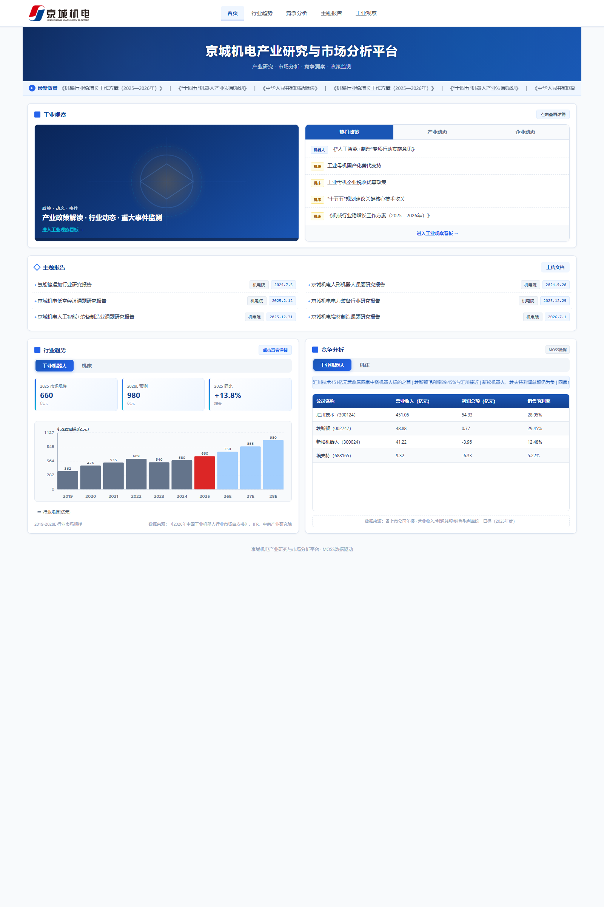
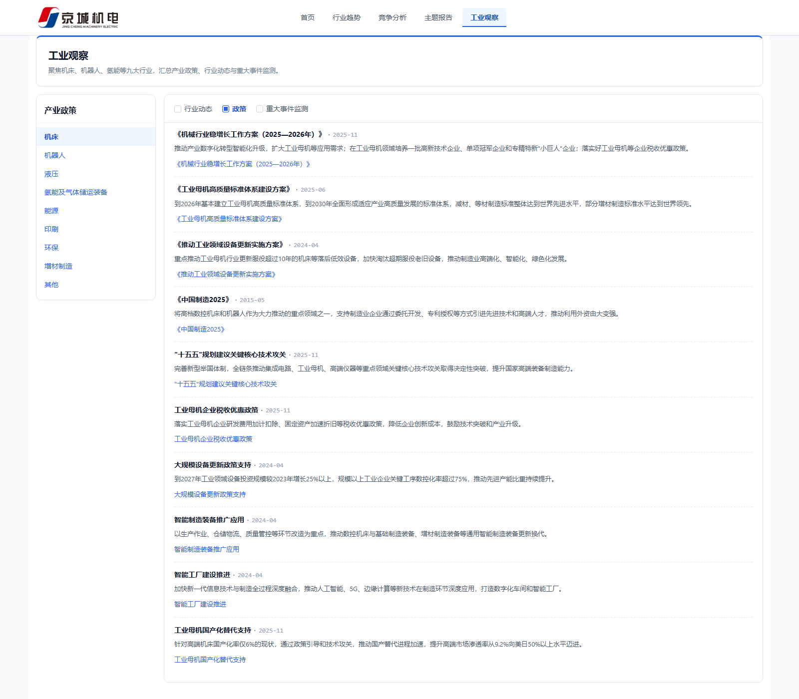
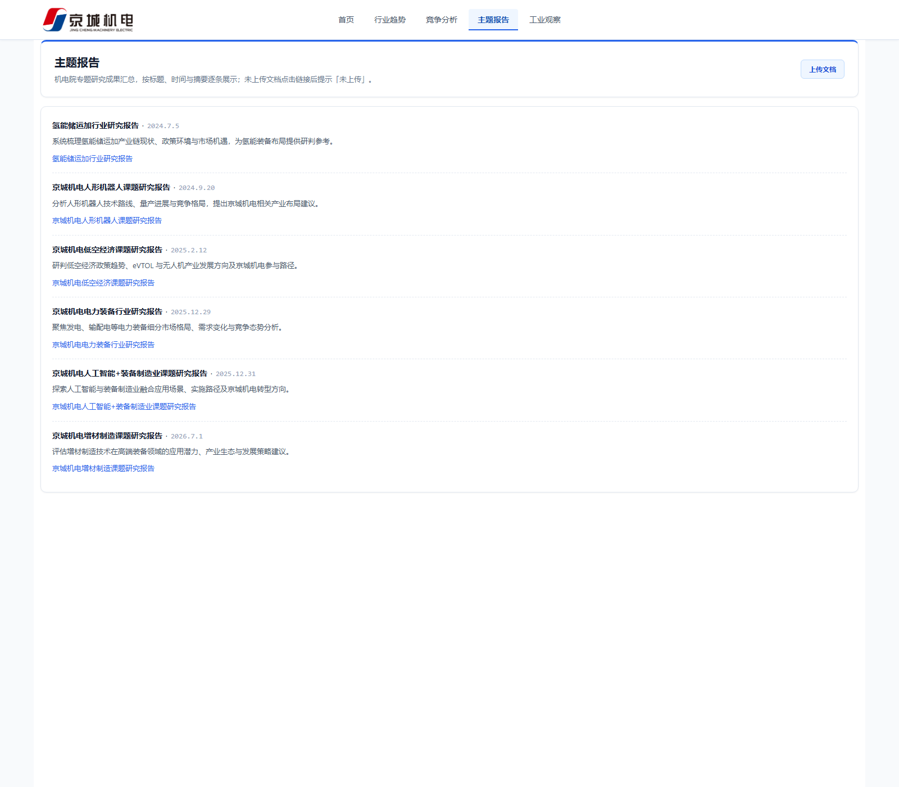
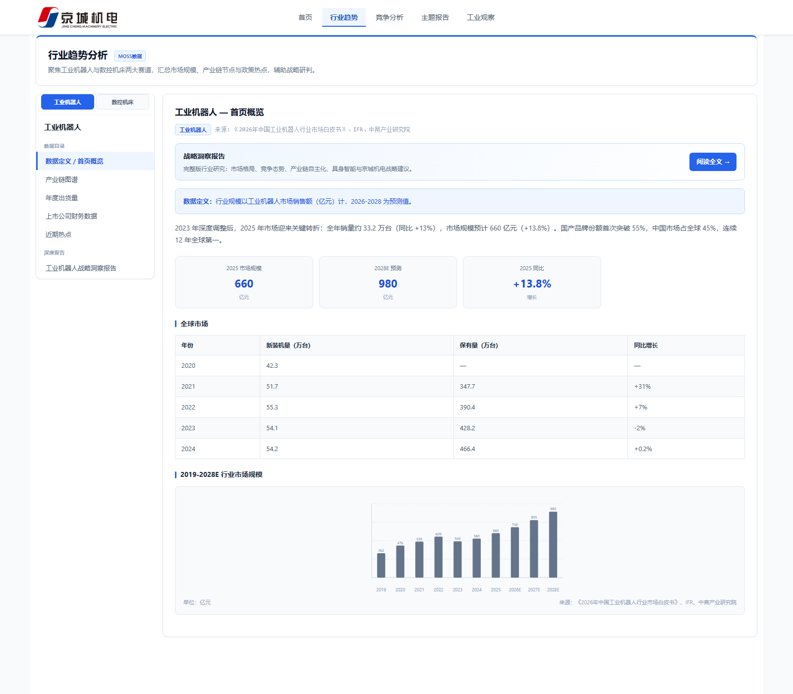
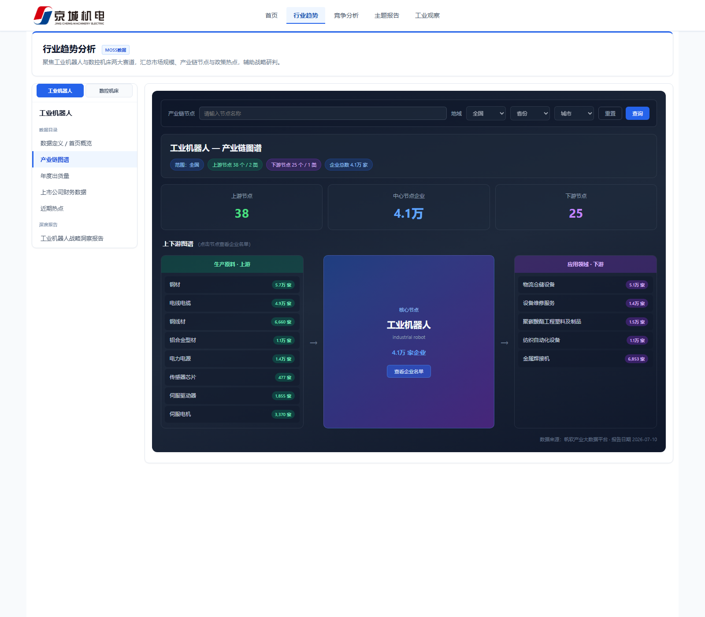
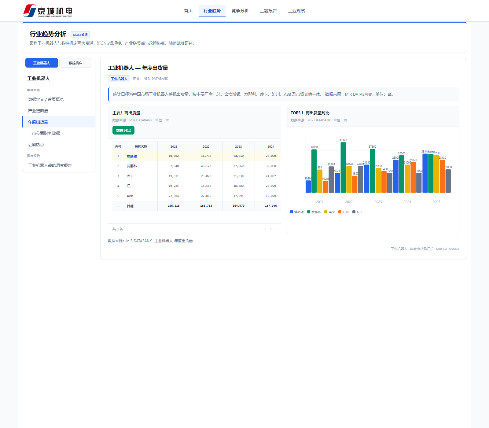
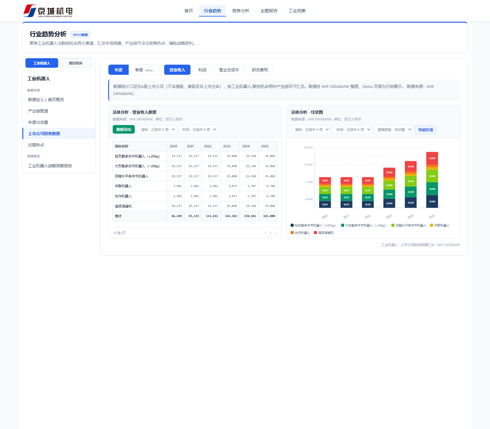
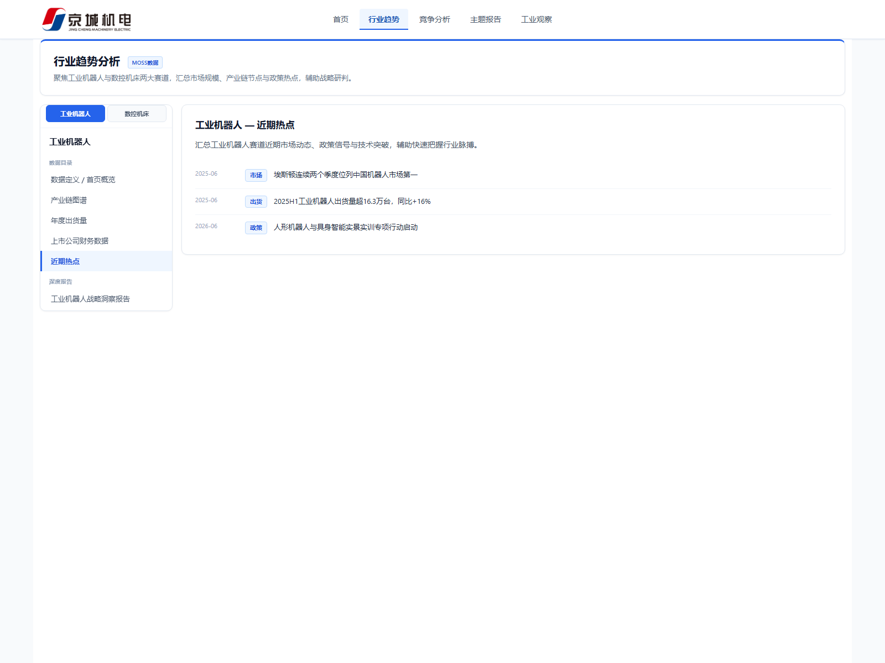
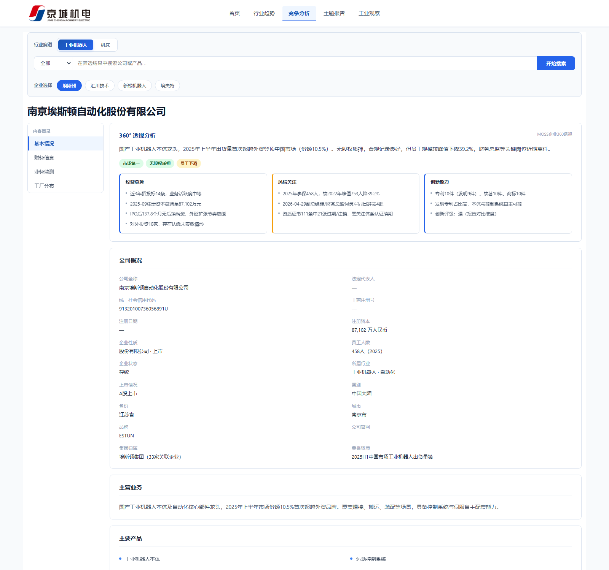

# 京城机电产业研究与市场分析平台 · 功能点需求清单（落地版）

> **文档版本**：V5.0
> **编制日期**：2026-08-12
> **编制依据**：《demo创建要求.docx》、`index.html` 最终界面、《京城机电-PRD功能需求规格书 V3.2》、Demo 页面截图（`images/` 目录）
> **关键前提（已确认）**：**首页界面 MOSS 做不了**，总看板整页 FDE 自建；**四个子页面 MOSS 都能做**，由 MOSS 原生承接，FDE 只做集成桥接与数据补供。
> **阅读方式**：按界面分类，先看 Demo 页面截图，再看该界面对应的功能点。功能点描述按「1. 实现效果 / 2. 用户怎么用」分点说明。

---

## 0. 建设方式定义与总体工作量

### 0.1 建设方式分类

| 标注 | 定义 | FDE 工作量性质 |
|------|------|----------------|
| **MOSS 原生** | MOSS 成品页面/能力承接，开箱可用；FDE 仅做嵌入对接、深链参数映射、权限打通 | 桥接配置，小 |
| **MOSS+FDE** | MOSS 承接页面或提供底层能力，但数据缺口需 FDE 补充整理（年报财务、MIR 出货量、业务/工厂数据、资讯采集），或个别功能 MOSS 缺项需 FDE 补齐 | 数据补供 + 局部定制，中 |
| **FDE 自建** | MOSS 无法承接（已确认：首页），FDE 全量研发 | 全量开发，大 |

### 0.2 总体工作量汇总（估算人天，待 MOSS 能力核查后复核）

| 模块（对应界面） | 建设主体 | 工作量（人天） | 说明 |
|------|----------|----------------|------|
| M1 总看板（首页） | **FDE 自建**（MOSS 做不了，已确认） | 25 | 整页自建：品牌区、导航、政策 Ticker、四模块摘要预览、深链跳转 |
| M2 工业观察 | MOSS 原生承接 + FDE 供数 | 25 | 页面 MOSS 承接，FDE 桥接/承接 ≈4；资讯数据 FDE 供入 3 + P2 后台采集审核 18 |
| M3 主题报告 | MOSS 原生承接 | 9.5 | 报告库/预览/上传全走 MOSS；仅定制 HTML 深度报告为 FDE 自建（5） |
| M4 行业趋势 | MOSS 原生承接 + FDE 补数 | 10.5 | 五视图 MOSS 承接；FDE 负责出货量（MIR）、年报财务、热点数据补供 |
| M5 竞争分析 | MOSS 原生承接 + FDE 补数 | 12 | 企业 360 页面 MOSS 承接；FDE 负责年报财务/业务/工厂数据补供、工厂地图接入 |
| C 公共能力与集成 | MOSS+FDE | 19.5 | MOSS 子页面集成是主工程量：嵌入容器、SSO、深链映射、风格对齐 |
| **合计** | | **≈101.5 人天** | |

### 0.3 按优先级汇总

| 阶段 | 工作量（人天） | 内容 |
|------|----------------|------|
| P0 本期必做 | ≈55.5 | 首页自建 + 四子页面 MOSS 承接与桥接 + 缺口数据补供 |
| P1 本期跟进 | ≈20.5 | MOSS 集成方案定稿落地（关键路径）、首页摘要数据接口化、更新时间展示 |
| P2 后续规划 | ≈25.5 | 资讯后台 CRUD 与定时采集、SSO 权限、报告下载统计 |

---

## 一、总看板（首页）· index.html · FDE 自建

> 界面文件：`index.html` ｜ 建设方式：**FDE 自建（MOSS 做不了，已确认）** ｜ 小计 25 人天（已完成 20）

| 编号 | 功能点 | 功能点描述 | 建设方式 | 人天 | 优先级 | 状态 |
|------|--------|-----------|----------|-----:|--------|------|
| M1-01 | 品牌区与整体布局 | 1. 实现效果：顶部展示平台名称「京城机电产业研究与市场分析平台」与副标题（产业研究·市场分析·竞争洞察·政策监测），页面按「上层工业观察、中层主题报告、底层左行业趋势右竞争分析」三层布局 2. 用户怎么用：打开平台即看到品牌形象与全部内容板块，一屏掌握平台定位 | FDE 自建 | 2 | P0 | 已完成 |
| M1-02 | 顶部导航 | 1. 实现效果：固定顶部导航含首页/行业趋势/竞争分析/主题报告/工业观察五项，当前页高亮，Logo 点击回首页 2. 用户怎么用：任意位置一键切换模块或回到首页；点击子页面项进入 MOSS 承接页 | FDE 自建 | 2 | P0 | 已完成 |
| M1-03 | 政策滚动播报 | 1. 实现效果：横向 Ticker 无缝滚动展示最新政策标题；无独立数据时自动回落工业观察政策库 2. 用户怎么用：浏览滚动的政策标题，点击感兴趣条目在新窗口打开政策原文 | FDE 自建 | 2 | P0 | 已完成 |
| M1-04 | 工业观察预览 | 1. 实现效果：左侧图文入口卡 + 右侧「热门政策/产业动态/企业动态」三 Tab 列表，各展示最新约 5 条 2. 用户怎么用：切换 Tab 浏览最新摘要，点击条目携带参数直达工业观察页对应条目，点击入口卡进入完整看板 | FDE 自建 | 3 | P0 | 已完成 |
| M1-05 | 主题报告预览 | 1. 实现效果：报告卡片列表（标题/作者/日期）+ 上传文档入口；报告无文档时 Toast 提示 2. 用户怎么用：点击报告卡跳转 MOSS 报告预览页阅读；点击上传按钮进入 MOSS 报告库后台（未开放时给出提示） | MOSS+FDE | 2.5 | P0 | 已完成 |
| M1-06 | 行业趋势预览 | 1. 实现效果：页签切换「工业机器人/机床」，展示该赛道 2019-2028E 市场规模柱线图与 KPI 摘要（按 demo 要求：左下角展示行业市场规模而非企业指标） 2. 用户怎么用：切换赛道对比两个行业的规模与增速，点击区块进入行业趋势完整分析 | MOSS+FDE | 3 | P0 | 已完成 |
| M1-07 | 竞争分析预览 | 1. 实现效果：页签切换赛道，展示竞对核心指标对比表（营收/利润/毛利率/规模/授权专利，来自客户提供的公司信息）+ 赛道要点滚动 2. 用户怎么用：切换赛道查看竞对指标对比，点击某一行进入该企业的竞争分析档案 | MOSS+FDE | 3 | P0 | 已完成 |
| M1-08 | 深链与参数传递 | 1. 实现效果：首页各入口跳转子页面时携带 `?industry=&view=&company=&tab=` 参数，子页面落地即定位到对应赛道/视图/企业 2. 用户怎么用：从首页任意摘要点击后无需重复选择，直达目标内容；复制链接分享可复现同一视图 | MOSS+FDE | 1.5 | P0 | 已完成 |
| M1-09 | 数据来源标注 | 1. 实现效果：每个图表/表格标注统计口径、数据来源、预测说明与更新时间 2. 用户怎么用：查看图表时同步确认可信度，管理层引用数据有据可查 | FDE 自建 | 1 | P0 | 已完成 |
| M1-10 | 首页摘要数据接口化 | 1. 实现效果：首页静态数据替换为 MOSS 接口实时获取（趋势/竞对/报告摘要），含加载中与失败降级展示 2. 用户怎么用：用户无感知，首页摘要随 MOSS 数据更新自动刷新 | MOSS+FDE | 4 | P1 | 未做 |
| M1-11 | 兼容与自适应 | 1. 实现效果：主流桌面浏览器兼容，1280~1480px 宽度自适应不变形 2. 用户怎么用：不同办公电脑/投屏分辨率下均可正常浏览 | FDE 自建 | 1 | P1 | 部分 |

---

## 二、工业观察 · MOSS 原生承接 + FDE 供数

> 界面文件：`pages/工业观察看板.html` ｜ 建设方式：**子页面 MOSS 原生承接，资讯数据 FDE 采集供入** ｜ 小计 25 人天
> 说明：MOSS 承接后，FDE 自建的 Demo 页不再重复建设，仅作为效果对照基线；重点工作量在资讯数据采集入库。
> 工作量口径：下表功能点合计 23 人天 + 子页面 MOSS 承接桥接（嵌入/深链/风格对齐）≈2 人天 = 25 人天。

| 编号 | 功能点 | 功能点描述 | 建设方式 | 人天 | 优先级 | 状态 |
|------|--------|-----------|----------|-----:|--------|------|
| M2-01 | 行业导航 | 1. 实现效果：左侧行业目录，本期「机床、机器人」两个行业（其他行业有数据后补充） 2. 用户怎么用：点击行业名称，右侧列表切换为该行业的全部资讯 | MOSS 原生 | 0.5 | P0 | 页面待 MOSS 承接 |
| M2-02 | 栏目切换 | 1. 实现效果：产业政策/行业动态/重大事件监测三栏目 Tab 2. 用户怎么用：点击 Tab 按内容类型浏览；行业×栏目组合过滤 | MOSS 原生 | 0.5 | P0 | 待承接 |
| M2-03 | 资讯列表 | 1. 实现效果：条目卡片展示标题、日期、来源、关键词、摘要，与 MOSS 字段口径对齐 2. 用户怎么用：浏览列表判断价值，决定打开哪条原文 | MOSS 原生 | 0.5 | P0 | 待承接 |
| M2-04 | 行业筛选 | 1. 实现效果：按行业过滤资讯列表，切换同步 URL 参数 2. 用户怎么用：聚焦本行业情报，过滤无关内容 | MOSS 原生 | — | P0 | 待承接 |
| M2-05 | 原文外链与深链定位 | 1. 实现效果：条目携带原文链接；支持 `?industry=&tab=&item=` 直达并高亮条目 2. 用户怎么用：点击条目在新窗口打开政策/新闻原文；分享链接可直接定位到某一条 | MOSS+FDE | 0.5 | P0 | 待承接 |
| M2-06 | 资讯数据供入 | 1. 实现效果：现有 69 条资讯（政策/动态/事件，覆盖机床、机器人、氢能）按 MOSS 入库规范结构化供入 2. 用户怎么用：上线即可浏览真实资讯内容，非空壳页面 | MOSS+FDE | 3 | P0 | 数据已完成，待入库 |
| M2-07 | 资讯库 + 后台 CRUD | 1. 实现效果：后台新增/编辑/删除/发布资讯；优先用 MOSS 资讯后台，缺项则 FDE 自建 2. 用户怎么用：运营人员登录后维护内容库，发布后前台即时可见 | MOSS / FDE 视核查 | 6 | P2 | 未做 |
| M2-08 | 定时采集 | 1. 实现效果：新华社、发改委、jc35 等多信源定时抓取入库；优先 MOSS 采集能力 2. 用户怎么用：无需人工录入，资讯每日自动更新保证时效 | MOSS / FDE 视核查 | 8 | P2 | 未做 |
| M2-09 | 审核去重 | 1. 实现效果：采集内容人工审核流 + 相似度去重 2. 用户怎么用：前台只见审核通过的、不重复的内容 | MOSS / FDE 视核查 | 4 | P2 | 未做 |
| M2-10 | 站内详情页 | 1. 实现效果：资讯正文站内展示（当前以外链原文为主，非必需） 2. 用户怎么用：无法打开外链时仍可看正文 | MOSS 原生 | — | P2 | 未做 |

---

## 三、主题报告 · MOSS 原生承接

> 界面文件：`pages/主题报告看板v5.2.html` ｜ 建设方式：**MOSS 报告库原生承接；定制 HTML 深度报告 FDE 自建** ｜ 小计 9.5 人天

| 编号 | 功能点 | 功能点描述 | 建设方式 | 人天 | 优先级 | 状态 |
|------|--------|-----------|----------|-----:|--------|------|
| M3-01 | 报告列表页 | 1. 实现效果：报告卡片展示标题、作者、日期、摘要；MOSS 报告库子页面承接，首页摘要卡 FDE 桥接 2. 用户怎么用：浏览报告库发现所需报告，点击进入阅读 | MOSS 原生 | 1 | P0 | 部分完成 |
| M3-02 | 报告在线预览 | 1. 实现效果：PDF/Word 在线预览，无需下载；使用 MOSS 文档预览原生能力 2. 用户怎么用：点击报告直接在线阅读，支持翻页浏览 | MOSS 原生 | 1 | P0 | 部分完成 |
| M3-03 | 报告上传/元数据/版本权限 | 1. 实现效果：MOSS 报告库后台支持上传 PDF/Word、维护标题/作者/摘要、替换下架、查看权限控制 2. 用户怎么用：产业研究团队撰写完成后在后台上传发布；管理员控制版本与可见范围 | MOSS 原生 | 1 | P1 | 未做（对接+培训） |
| M3-04 | 下载/分享/浏览统计 | 1. 实现效果：下载原文、复制分享链接、浏览量统计（MOSS 原生） 2. 用户怎么用：下载报告归档或转发同事；运营查看热度 | MOSS 原生 | 0.5 | P2 | 未做 |
| M3-05 | 定制 HTML 深度报告 | 1. 实现效果：机器人战略洞察、数控机床国产替代五看三定两份深度报告，左目录 + 右 PDF 式阅读视图（demo 要求的展示形式） 2. 用户怎么用：点击左侧目录章节跳转，右侧如读 PDF 般滚动阅读图文报告 | FDE 自建 | 5 | P0 | 已完成 |
| M3-06 | 上传入口桥接 | 1. 实现效果：首页/主题报告看板的上传按钮跳转 MOSS 报告库后台；未开放时 Toast 提示 2. 用户怎么用：研究人员从平台内直达上传入口 | MOSS+FDE | 1 | P1 | 部分完成 |
| M3-07 | 检索/筛选/排序 | 1. 实现效果：关键词搜索、多维筛选、排序（MOSS 原生支持）——**本期确认不开启** 2. 用户怎么用：（后续开放）按名称/行业/时间快速定位报告 | MOSS 原生 | — | — | 本期不做 |

---

## 四、行业趋势 · MOSS 原生承接 + FDE 数据补供

> 界面文件：`pages/行业趋势.html` ｜ 建设方式：**五视图整页 MOSS 承接（demo 要求产业链图谱直接用 MOSS 产业上下游 demo）；FDE 负责出货量/年报财务/热点数据补供** ｜ 小计 10.5 人天
> 左侧目录 + 右侧内容区布局；上方页签切换「工业机器人/机床」两个赛道，全部视图联动刷新。

### 4.1 概览视图

| 编号 | 功能点 | 功能点描述 | 建设方式 | 人天 | 优先级 | 状态 |
|------|--------|-----------|----------|-----:|--------|------|
| M4-01 | 赛道切换与视图导航 | 1. 实现效果：顶部页签切换工业机器人/机床，左侧目录含概览/产业链图谱/年度出货量/上市公司财务/近期热点/深度报告，切换全视图联动 2. 用户怎么用：选赛道→选视图，两步进入目标分析场景 | MOSS 原生 | 0.5 | P0 | 待承接 |
| M4-02 | URL 状态直达 | 1. 实现效果：`?industry=&view=` 参数保留当前赛道与视图状态 2. 用户怎么用：刷新不丢状态，复制链接分享给同事可复现同一视图 | MOSS+FDE | 0.5 | P0 | 待承接 |
| M4-03 | 行业概览 | 1. 实现效果：市场规模、增速等 KPI 卡 + 全球/中国市场数据表 + 统计口径与预测说明 2. 用户怎么用：一眼掌握行业规模与增速，表格下查口径依据 | MOSS 原生 | 0.5 | P0 | 待承接 |
| M4-04 | 市场规模图 | 1. 实现效果：2019-2028E 柱线图，历史值与预测值样式区分、高亮年度 2. 用户怎么用：观察行业规模走势与预测拐点，支撑判断 | MOSS 原生 | 0.5 | P0 | 待承接 |
| M4-12 | 深度报告入口 | 1. 实现效果：概览页挂「机器人战略洞察报告」入口，跳转 FDE 自建的左目录+PDF 式阅读页 2. 用户怎么用：看完概览数据后一键进入深度战略解读 | FDE 自建 | 0.5 | P0 | 已完成 |

### 4.2 产业链图谱视图

| 编号 | 功能点 | 功能点描述 | 建设方式 | 人天 | 优先级 | 状态 |
|------|--------|-----------|----------|-----:|--------|------|
| M4-05 | 产业链图谱 | 1. 实现效果：上游—核心—下游节点结构展示，含各节点企业数统计；**直接使用 MOSS 产业上下游 demo 能力** 2. 用户怎么用：浏览图谱理解产业链结构，点击节点展开查看代表企业名单（名称、地域、类型、规模） | MOSS 原生 | 0.5 | P0 | 待承接 |
| M4-06 | 产业链搜索/地域筛选 | 1. 实现效果：按节点/企业名称搜索，省市下拉筛选企业（需求方确认本期实现；MOSS 原生项则零成本，缺项 FDE 补齐） 2. 用户怎么用：输入企业名快速定位其在产业链中的位置；按省市筛选观察区域分布 | MOSS 原生 / FDE 视核查 | 1 | P0 | 待核查 |

### 4.3 年度出货量视图

| 编号 | 功能点 | 功能点描述 | 建设方式 | 人天 | 优先级 | 状态 |
|------|--------|-----------|----------|-----:|--------|------|
| M4-07 | 年度出货量表与趋势图 | 1. 实现效果：机器人按厂商、机床按品类的出货量表 + 柱线趋势图；数据由 FDE 从 MIR DATABANK 整理后供入 MOSS 2. 用户怎么用：查看各厂商/品类历年出货量与份额变化，判断市场格局 | MOSS+FDE | 2 | P0 | 数据已整理，待供入 |
| M4-08 | 出货量分页 + Excel 导出 | 1. 实现效果：表格分页浏览 + 一键导出 Excel（确认本期实现；MOSS 表格组件原生能力） 2. 用户怎么用：翻页查看大表；导出 Excel 用于离线分析与汇报 | MOSS 原生 | 0.5 | P0 | 待核查 |

### 4.4 上市公司财务视图

| 编号 | 功能点 | 功能点描述 | 建设方式 | 人天 | 优先级 | 状态 |
|------|--------|-----------|----------|-----:|--------|------|
| M4-09 | 财务分析 | 1. 实现效果：年度/季度切换，营收/利润/成本/研发指标切换，数据表与堆叠柱图联动，数值显隐开关 2. 用户怎么用：选周期与指标观察上市公司财务走势，隐藏数值获得更简洁的汇报用图 | MOSS+FDE | 2 | P0 | 页面已实现；**数据为 Demo 占位，需补真实年报数据（缺口 D1）** |
| M4-10 | 财务高级筛选 + 导出 | 1. 实现效果：按指标/时间/图表类型筛选，Excel 导出（确认本期实现；MOSS 原生能力） 2. 用户怎么用：按需圈选数据范围，导出用于建模或报告 | MOSS 原生 | 0.5 | P0 | 待核查 |

### 4.5 近期热点视图

| 编号 | 功能点 | 功能点描述 | 建设方式 | 人天 | 优先级 | 状态 |
|------|--------|-----------|----------|-----:|--------|------|
| M4-11 | 近期热点 | 1. 实现效果：热点列表（日期/标签/标题）、时间范围筛选；下钻跳转原文或工业观察条目（确认本期实现）；热点条目由 FDE 供入（可复用工业观察资讯） 2. 用户怎么用：按时间过滤查看行业最新动态，点击下钻阅读详情 | MOSS+FDE | 1.5 | P0 | 待承接 |

---

## 五、竞争分析 · MOSS 原生承接 + FDE 数据补供

> 界面文件：`pages/竞争分析看板_v4.5.html` ｜ 建设方式：**企业 360° 透视整页 MOSS 承接（demo 要求"第一模块用企业360洞察已有内容"）；财务/业务/工厂数据 FDE 补供** ｜ 小计 12 人天
> 已覆盖竞对 8 家：工业机器人（埃斯顿、汇川、新松、埃夫特）；机床/装备制造（东方电气、上海电气、沈阳机床、秦川机床）。界面布局：顶部赛道 Tab + 企业搜索/列表，左侧内容目录，右侧档案详情（基本情况/财务信息/业务监测/工厂分布四 Tab）。

| 编号 | 功能点 | 功能点描述 | 建设方式 | 人天 | 优先级 | 状态 |
|------|--------|-----------|----------|-----:|--------|------|
| M5-01 | 赛道切换与企业清单 | 1. 实现效果：工业机器人/机床 Tab 切换，按赛道加载竞对列表（含规模、上市状态） 2. 用户怎么用：选择赛道后从企业列表中挑选竞对进入档案 | MOSS 原生 | 0.5 | P0 | 待承接 |
| M5-02 | 企业搜索/切换/深链 | 1. 实现效果：关键词搜索（范围：全部/名称/产品/行业），点击切换档案，`?industry=&company=&tab=` 直达目标企业 2. 用户怎么用：输入名称或产品关键词快速找到目标企业；分享链接直达某企业档案 | MOSS+FDE | 1 | P0 | 待承接 |
| M5-03 | 企业 360° 档案（基本情况 Tab） | 1. 实现效果：工商信息、经营概况、主营产品、集团归属、360° 摘要（综合判断/标签/经营·风险·创新洞察）、招投标信号、工商变更、人员风险、知识产权、资质风险、股权风险、融资历史共 12 块——MOSS 企业 360 洞察页原承接 2. 用户怎么用：一屏查看竞对全景档案，重点看 360° 摘要快速形成综合判断，再按块下钻细节 | MOSS 原生 | 0.5 | P0 | 待承接 |
| M5-04 | 财务信息 Tab | 1. 实现效果：营收/利润趋势图 + 财务数据表（营收、利润、资产、负债、毛利率，年度/季度切换）；缺口数据由 FDE 从年报整理补供（即 demo 要求"第二模块补 PDF 内容"） 2. 用户怎么用：观察竞对营收利润走势与盈利能力，与本企业对标 | MOSS+FDE | 3 | P0 | 机器人四强有数据（止于 2023）；机床四强待核验修正（缺口 D2） |
| M5-05 | 业务监测 Tab | 1. 实现效果：产品年度/季度业务数据表；数据由 FDE 从年报/PDF 结构化整理补供（demo 阶段仅展示 PDF 图片，落地升级为结构化表） 2. 用户怎么用：跟踪竞对各产品线的业务表现变化 | MOSS+FDE | 2.5 | P0 | 数据已整理，待供入 |
| M5-06 | 工厂分布 Tab·列表 | 1. 实现效果：工厂名称、地址、产能、产品列表；数据补供 2. 用户怎么用：了解竞对产能布局与产品线对应关系 | MOSS+FDE | 1.5 | P0 | 8 家工厂清单已有；产能缺失与地址待补（缺口 D3） |
| M5-07 | 工厂分布 Tab·地图 | 1. 实现效果：区域地图标注工厂点位（确认本期实现；MOSS 有地图则零成本，缺项则 FDE 接第三方地图 API） 2. 用户怎么用：地图视角直观查看竞对工厂的全国布局 | MOSS / FDE 视核查 | 2 | P0 | 待核查 |
| M5-08 | 工厂条件筛选 | 1. 实现效果：按产品、地区、状态筛选工厂（确认本期实现） 2. 用户怎么用：聚焦特定产品线或区域的产能 | MOSS 原生 | 0.5 | P0 | 待核查 |
| M5-09 | 数据导出 | 1. 实现效果：档案/财务/业务数据 Excel 导出（确认本期实现；MOSS 原生导出） 2. 用户怎么用：一键导出用于离线分析、汇报材料 | MOSS 原生 | 0.5 | P0 | 待核查 |
| M5-10 | 本方画像/招投标/对标 | 1. 实现效果：京城机电本方档案、230 条招投标、本方 vs 竞对对标——**本期确认不做**（数据已具备，后续可开放） 2. 用户怎么用：（后续）本方与竞对同屏对比找差距 | — | — | — | 本期不做 |

---

## 六、C 公共能力与集成（本项目 MOSS+FDE 主工程量）

> 子页面全部 MOSS 承接后，集成质量决定项目成败：嵌入容器、SSO、深链参数透传、风格与导航一致性。

| 编号 | 功能点 | 功能点描述 | 建设方式 | 人天 | 优先级 | 状态 |
|------|--------|-----------|----------|-----:|--------|------|
| C-01 | MOSS 子页面集成 | 1. 实现效果：集成选型定稿（iframe/微前端嵌入 或 SSO 跳转）+ 四个子页面接入首页导航、深链参数透传、登录态与权限传递、主题风格与导航对齐、回跳首页 2. 用户怎么用：从首页进入子页面体验连贯（无割裂感），登录一次全平台通行 | MOSS+FDE | 10 | P1 | 未做（**关键路径**） |
| C-02 | 统一登录与权限 | 1. 实现效果：MOSS SSO 对接，按角色控制页面、数据、导出权限 2. 用户怎么用：账号登录；管理层与研究人员按需授权 | MOSS+FDE | 5 | P2 | 未做 |
| C-03 | 更新时间展示 | 1. 实现效果：各数据源展示最近更新时间（MOSS 原生则零成本，首页自建区域 FDE 补） 2. 用户怎么用：判断数据新鲜度 | MOSS+FDE | 1.5 | P1 | 未做 |
| C-04 | 反馈体系 | 1. 实现效果：首页与桥接层 Toast、空态、功能未开放提示 2. 用户怎么用：操作受阻时得到明确提示而非无反应 | FDE 自建 | 1 | P0 | 部分完成 |
| C-05 | 供入数据校验 | 1. 实现效果：FDE 供入 MOSS 的数据（资讯、出货量、财务、业务、工厂）结构校验脚本，保证入库质量 2. 用户怎么用：（后台）防止脏数据进入平台 | MOSS+FDE | 2 | P1 | 未做 |

---

## 七、MOSS 能力核查清单（开发启动前逐项确认）

> 以下功能点默认 MOSS 原生覆盖，需在集成选型时与 MOSS 侧核实；缺项则转 FDE 补齐（M4-06/M5-07 已预留机动人天）。

| 序号 | 核查项 | 影响功能点 |
|------|--------|-----------|
| 1 | MOSS 是否有资讯/政策子页面与资讯后台（入库、CRUD、采集） | M2 全部 |
| 2 | MOSS 产业链图谱是否含节点搜索、地域（省市）筛选 | M4-06 |
| 3 | MOSS 表格组件是否自带分页 + Excel 导出 | M4-08、M4-10、M5-09 |
| 4 | MOSS 财务模块是否支持高级筛选（指标/时间/图表类型） | M4-10 |
| 5 | MOSS 是否有热点视图及时间筛选 | M4-11 |
| 6 | MOSS 工厂分布是否含地图展示与条件筛选 | M5-07、M5-08 |
| 7 | MOSS 报告库后台上传/元数据/权限是否可用、上传格式是否含 HTML | M3-03 |
| 8 | MOSS 子页面支持的嵌入方式（iframe/微前端）与深链参数规范 | C-01、全部深链 |
| 9 | MOSS 数据供入规范（字段、格式、入库接口） | M2-06、M4-07/09/11、M5-04~06 |

---

## 八、实施建议

1. **第一阶段（P0，≈55.5 人天）**：首页自建已基本完成（20 人天存量）；重点为四子页面 MOSS 承接桥接 + 缺口数据补供（年报财务、MIR 出货量、业务/工厂、资讯入库）。
2. **第二阶段（P1，≈20.5 人天）**：**C-01 MOSS 集成选型是关键路径**；建议先完成第七章能力核查，再定嵌入/SSO 方案，随后做首页摘要数据接口化（M1-10）。
3. **第三阶段（P2，≈25.5 人天）**：资讯后台与采集（视 MOSS 资讯后台能力决定 FDE 是否自建）、SSO 权限、报告下载统计。
4. **明确不做（已确认）**：主题报告检索/筛选/排序；定制 HTML 报告挂载报告列表；本方画像/招投标/竞对对标。

---

## 九、附：已具备数据资产（可直接供入 MOSS）

| 数据 | 现状 | 真实度 |
|------|------|--------|
| 竞对 360 档案 | 8 家竞对 + 本方京城机电（MOSS 企业 360 透视导出，`compete-profile-data.js`） | 真实 |
| 行业规模 | 工业机器人/机床 2019-2028E（含预测与统计口径） | 真实 |
| 产业链图谱 | 两赛道上游—核心—下游节点、节点企业数、代表企业名单（地域/类型/规模） | 基本真实，代表企业为示例抽样 |
| 出货量 | 机器人按厂商（埃斯顿/发那科/库卡/汇川/ABB 等）、机床按品类，2019-2025（MIR DATABANK 导出） | 真实 |
| 竞争分析·财务信息 | 机器人四强（埃斯顿/汇川/新松/埃夫特）2013-2023 年度财务；机床四强数据见缺口清单 D2 | 部分真实，需更新 |
| 竞争分析·业务监测 | 8 家竞对产品线年度/季度业务数据（MIR DATABANK） | 真实 |
| 竞争分析·工厂分布 | 8 家竞对工厂清单（名称/地址/状态/投产时间/产品/产能） | 基本真实，产能列多处缺失 |
| 资讯 | 70 条（政策 30 / 动态 21 / 事件 19；机床 30、机器人 20、氢能 20），全部含原文链接 | 真实 |
| 定制报告 | 机器人战略洞察、数控机床国产替代五看三定（HTML 成品页） | 真实 |
| 界面截图 | 9 张 Demo 截图（`images/` 目录，本文档配图来源） | — |

> **注意（数据真实度说明）**：行业趋势「上市公司财务」视图当前为 **Demo 占位数据**（文件头明确标注，利润/成本/研发为按固定比例推算），上线前必须用真实年报数据替换，详见第十节缺口 D1。

---

## 十、还需补充的数据资产（缺口清单）

> 以下数据缺口中，D1、D2 直接影响上线数据的真实性，为最高优先级；D3-D8 影响功能完整度或后续运营。建议客户侧与 FDE 在开发启动前逐项确认来源与责任人。

| 编号 | 缺失数据资产 | 影响功能点 | 缺口说明 | 建议来源/责任方 | 优先级 |
|------|-------------|-----------|----------|----------------|--------|
| D1 | **上市公司财务真实数据（行业趋势·上市公司财务视图）** | M4-09、M4-10 | 当前 `trend-finance-data.js` 为 Demo 占位：利润=营收×8.2%、成本=营收×78%、研发=营收×6.5% 固定推算，季度数据为年度数据按比例拆分（标注 `demo: true`）；且表格维度为「产品品类」，需按需求改为「上市公司年报财务表」（营收/利润/资产/负债/毛利率，按公司展示）。需两赛道上市公司 2020-2025 年度 + 近 6 季度真实数据 | MIR DATABANK 交付 / FDE 从年报整理 | **P0** |
| D2 | **竞对财务数据核验、修正与时效更新** | M5-04 | ① 装备制造四强（东方电气/上海电气/沈阳机床/秦川机床）财务数据（`comp-0~3`）存在**企业映射顺序不一致**（数据文件中两处排序不同）与**计量单位口径不明**问题，且部分数值与上市公司年报公开规模差异较大，供入 MOSS 前必须逐家核验修正；② 机器人四强财务序列仅到 2023 年，需补 2024、2025 年报数据（首页竞对预览已使用 2025 年报口径，两处需对齐） | Wind / 各公司年报（公开），FDE 核验 | **P0** |
| D3 | **工厂产能与坐标完善** | M5-06、M5-07 | 8 家竞对工厂清单已有，但：① 产能字段多处为「—」（如埃斯顿佛山在建厂、东方电气德阳总部）；② 地址仅到市级（如「德阳市」「南京市」），地图打点需省级字段或经纬度（可由 FDE 统一地理编码，但需先确认地址准确性）；③ 个别工厂名称缺失（如埃斯顿南京伺服工厂行） | MIR / 竞对年报 + FDE 地理编码 | P0 |
| D4 | **报告库正式文件** | M3-01~M3-03 | 报告库中目前仅有 2 份定制 HTML 报告；MOSS 报告库上线需正式 PDF/Word 研究报告文件及配套元数据（标题、作者、发布日期、摘要），否则报告列表为空壳 | 京城机电产业研究团队提供 | **P0** |
| D5 | **资讯持续更新与采集源确定** | M2-06~M2-09、M1-03 | 现 70 条资讯为存量 Demo，上线后需持续更新：① 采集目标信源清单需确认（新华社、国家发改委、工信部、科技部、国家能源局、机床商务网、jc35 等）；② 25 条来源标注为「行业公开资讯」的条目入库前需规范化来源归属；③ 采集频率与审核流程需与运营约定 | 客户运营 + FDE 采集配置 | P1 |
| D6 | **近期热点条目结构化** | M4-11 | 热点条目可复用资讯数据，但需按 MOSS 供入格式整理热点专项子集（含日期/标签/下钻目标链接）；机床赛道热点需从 30 条机床资讯中筛选确认 | FDE 整理（复用现有资讯） | P1 |
| D7 | **MOSS 供入规范与接口** | 全部供入项（M2-06、M4-07/09/11、M5-04~06） | FDE 所有供入数据（资讯、出货量、财务、业务、工厂、热点）需按 MOSS 字段规范结构化；**该项是数据准备的前置依赖**——MOSS 侧提供入库接口/模板后，FDE 才能做最终数据适配与 C-05 校验 | MOSS 侧提供 | **P0（前置）** |
| D8 | **产业链图谱节点企业扩展（视 MOSS 图谱要求）** | M4-05、M4-06 | 现图谱代表企业为示例抽样（每节点 5-6 家）；若 MOSS 产业上下游 demo 要求完整企业清单或产能/营收字段，需补充节点企业全量数据；若直接使用 MOSS 内置图谱则无需提供 | 依 MOSS 能力核查结果定 | P1 |

### 数据缺口责任分工建议

| 责任方 | 需提供/确认的数据 |
|--------|------------------|
| **京城机电（客户）** | D4 报告库正式报告文件与元数据；D5 采集信源确认与运营审核流程；D2 中非上市公司财务（如有内部渠道） |
| **MIR DATABANK（数据供应商）** | D1 上市公司财务真实数据；D2 竞对财务修正与 2024-2025 更新；D3 工厂产能补全（按现有 MIR 服务范围） |
| **MOSS 侧** | D7 供入规范/入库接口/字段模板；D8 产业链图谱数据要求说明 |
| **FDE** | D1/M5 数据的年报公开渠道整理备份；D3 地址地理编码；D6 热点条目整理；D5 采集实施；全部数据的供入格式适配与校验 |
